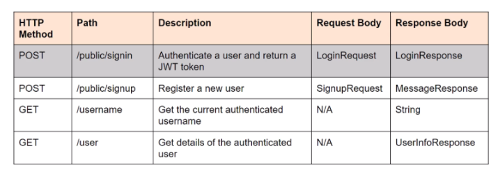

## 1일차
- 전통적인 Spring MVC의 컨트롤러인 @Controller는 주로 View를 반환하기 위해 사용
- Spring MVC Container는 Client의 요청으로부터 View를 반환
- 하지만 Spring MVC의 컨트롤러를 사용하면서 Data를 반환해야 하는 경우도 있다.
- 컨트롤러에서는 데이터를 반환하기 위해 @ResponseBody 어노테이션을 활용해주어야 한다.
- 이를 통해 Controller도 Json 형태로 데이터를 반환

### RestController
- @Controller에 @ResponseBody가 추가된 것
- 주 용도는 Json 형태로 객체 데이터를 반환하는 것

###  Security
- spring Security 두가지 인증 방식
  - formLogin 인증방식 : 서버에 해당 사용자의 session 상태가 유효한지를 판단해서 처리하는 인증 방식
  - HttpBasic 인증방식 : Http 프로토콜에서 정의한 기본 인증 방식, 사용자는 아이디와 패스워드를 인코딩한 문자열을 Authorization 헤더에 담아서 요청, HTTP는 기본적으로 무상태를 유지하는데 이는 서버가 클라이언트의 상태를 보존하지 않는다는 뜻
   
    ```javascript
    @Configuration
    @EnableWebSecurity
    public class SecurityConfig {

    @Bean   //Configuration 필수
    SecurityFilterChain securityFilterChain(HttpSecurity http) throws Exception {
        http.authorizeHttpRequests(((requests) ->
                requests
                        .requestMatchers("/contact").permitAll()
                        .requestMatchers("/public/**").permitAll()
                .anyRequest().authenticated()));
        //http.formLogin(withDefaults());
        http.sessionManagement(session -> session.sessionCreationPolicy(SessionCreationPolicy.STATELESS));
        http.httpBasic(withDefaults());
        return http.build();
    }
}
    ```

## 2일차
- Note 서비스 구현

    ```javascript
    @Service
    public class NoteServiceImpl implements NoteService {

    @Autowired  // 의존성 주입
    private NoteRepository noteRepository;
    
    @Override   
    public Note createNoteForUser(String username, String content) {    //Note 추가
        Note note = new Note(); //Note 객체를 생성
        note.setContent(content);   // 추가
        note.setOwnerUsername(username);    //추가
        Note savedNote = noteRepository.save(note); //추가 한 값들을 저장
        return savedNote;
    }

    @Override
    public Note updateNoteForUser(Long noteId, String content, String username) {   //Note 수정(userID값을 가져와 수정)
        Note note = noteRepository.findById(noteId).orElseThrow(()  // 1일차에 작성한 해당 id값이 존재하지 않으면 오류 발생
                -> new RuntimeException("Note not found"));
        note.setContent(content);
        Note updatedNote = noteRepository.save(note);   //jpa는 추가와 변경 모두 save()를 사용
        return updatedNote;
    }

    @Override
    public void deleteNoteForUser(Long noteId, String username) {   //Note 삭제(userID값을 가져와 삭제)
        noteRepository.deleteById(noteId);
    }

    @Override
    public List<Note> getNotesForUser(String username) {    //Note 전체보기(username을 통하여 List 반환)
        List<Note> personalNotes = noteRepository
                .findByOwnerUsername(username);
        return personalNotes;
        }
    }
    ```
  
- Note 컨트롤러 구현

    ```javascript
    @RestController
    @RequestMapping("/api/notes")   //해당 컨트롤러 공동으로 기본 url을 사용하도록 설정
    public class NoteController {

    @Autowired  //의존성 주입
    private NoteService noteService;

    // 노트 추가
    @PostMapping
    public Note createNote(@RequestBody String content, @AuthenticationPrincipal UserDetails userDetails) {
    // RequestBody = 요청값을 자바 객체로 반환, 
    // AuthenticationPrincipal = 세션 정보 UserDetails에 접근할 수 있는 어노테이션 (로그인 세션 정보가 필요한 컨트롤러에서 정보를 받아서 사용)
        String username = userDetails.getUsername();
        System.out.println("USER: " + username);
        return noteService.createNoteForUser(username, content);
        }

    // 노트 전체 가져오기
    @GetMapping
    public List<Note> getUserNotes(@AuthenticationPrincipal UserDetails userDetails) {
        String username = userDetails.getUsername();
        System.out.println("USER: " + username);
        return noteService.getNotesForUser(username);
        }

    // 노트 수정
    @PutMapping("/{noteId}")
    public Note updateNote(@PathVariable Long noteId, @RequestBody String content, @AuthenticationPrincipal UserDetails userDetails) {
        String username = userDetails.getUsername();
        return noteService.updateNoteForUser(noteId, content, username);
        }

    // 노트 삭제
    @DeleteMapping("/{noteId}")
    public void deleteNote(@PathVariable Long noteId, @AuthenticationPrincipal UserDetails userDetails) {
    //PathVariable = 경로 변수를 표시하기 위해 메서드에 매개변수에 사용, {}로 둘러싸인 값
        String username = userDetails.getUsername();
        noteService.deleteNoteForUser(noteId, username);
        }

    }
    ```

- securityConfig 변경
    ```javascript
    포스트맨으로 전체 Note의 목록은 출력이 되었지만, Post로 Note를 생성하려고 하였으나 401 오류 발생
    디버깅 결과 CSRF 보호로 인해 활성화된 상태에서 인증만으로 POST 요청을 처리하면 401 오류가 발생
    보호 비활성화를 위해 http.csrf(AbstractHttpConfigurer::disable); 작성
    ```
  

## 3일차
- Auth API 인증 API 제작




- 가입
  ```javascript
   @PostMapping("/public/signup")
    public ResponseEntity<?> registerUser(@Valid @RequestBody SignupRequest signUpRequest) {
        // 현재 있는 username일 경우에 메시지 전환
        if (userRepository.existsByUserName(signUpRequest.getUsername())) {
            return ResponseEntity.badRequest().body(new MessageResponse("Error: Username is already taken!"));
        }
        // 현재 있는 email일 경우에 메시지 전환
        if (userRepository.existsByEmail(signUpRequest.getEmail())) {
            return ResponseEntity.badRequest().body(new MessageResponse("Error: Email is already in use!"));
        }

        // 유저 등록
        User user = new User(signUpRequest.getUsername(),
                signUpRequest.getEmail(),
                encoder.encode(signUpRequest.getPassword()));

        Set<String> strRoles = signUpRequest.getRole();
        Role role;

        if (strRoles == null || strRoles.isEmpty()) {
            role = roleRepository.findByRoleName(AppRole.ROLE_USER)
                    .orElseThrow(() -> new RuntimeException("Error: Role is not found."));
        } else {
            String roleStr = strRoles.iterator().next();
            if (roleStr.equals("admin")) {
                role = roleRepository.findByRoleName(AppRole.ROLE_ADMIN)
                        .orElseThrow(() -> new RuntimeException("Error: Role is not found."));
            } else {
                role = roleRepository.findByRoleName(AppRole.ROLE_USER)
                        .orElseThrow(() -> new RuntimeException("Error: Role is not found."));
            }

            user.setAccountNonLocked(true);
            user.setAccountNonExpired(true);
            user.setCredentialsNonExpired(true);
            user.setEnabled(true);
            user.setCredentialsExpiryDate(LocalDate.now().plusYears(1));
            user.setAccountExpiryDate(LocalDate.now().plusYears(1));
            user.setTwoFactorEnabled(false);
            user.setSignUpMethod("email");
        }
        user.setRole(role);
        // 유저 저장
        userRepository.save(user);

        return ResponseEntity.ok(new MessageResponse("User registered successfully!"));
    }
  ```
- 인증된 유저 정보 가져오기
  ```javascript
     @GetMapping("/user")
    public ResponseEntity<?> getUserDetails(@AuthenticationPrincipal UserDetails userDetails) {
       //@AuthenticationPrincipal은 로그인한 사용자 정보를 어노테이션을 통해 간편하게 받아올수 있다.
        User user = userService.findByUsername(userDetails.getUsername());

        List<String> roles = userDetails.getAuthorities().stream()
                .map(item -> item.getAuthority())
                .collect(Collectors.toList());

        UserInfoResponse response = new UserInfoResponse(
                user.getUserId(),
                user.getUserName(),
                user.getEmail(),
                user.isAccountNonLocked(),
                user.isAccountNonExpired(),
                user.isCredentialsNonExpired(),
                user.isEnabled(),
                user.getCredentialsExpiryDate(),
                user.getAccountExpiryDate(),
                user.isTwoFactorEnabled(),
                roles
        );

        return ResponseEntity.ok().body(response);
    }
  ```
    -  UserServiceImpl에 유저네임으로 유저를 찾는 메소드를 만들어 @Override로 인터페이스에 추상 메서드 만들기
  ```javascript
      @Override
        public User findByUsername(String username) {
            Optional<User> user = userRepository.findByUserName(username);
            return user.orElseThrow(() -> new RuntimeException("User not found with username: " + username));
      }
  ```
  
  - 인증된 유저 이름만 가져오기
  ```javascript
    @GetMapping("/username")
    public String getUsername(Principal principal) {
        // 삼항연산자
        // name이 null이 아니면 name출력, null이면 빈문자열 반환 
        return principal.getName() != null ? principal.getName() : "";
    }
  ```